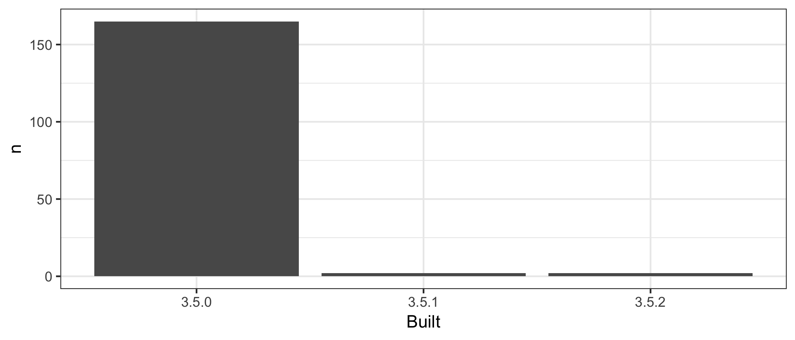

<!-- README.md is generated from README.Rmd. Please edit that file -->

```{r setup, include = FALSE}
knitr::opts_chunk$set(
  collapse = TRUE,
  comment = "#>"
)
library(tidyverse)
```

# packages-report

## Bonus activity prompt

* I presume you are hooked up to GitHub remote repo, covered in [Existing project, GitHub last](https://happygitwithr.com/existing-github-last.html). Summary:
  - Consider the convenience function `usethis::use_github()`. Or to do by hand:
  - Create a similarly-named repo on GitHub.
  - Add it to the local repo as the `origin` remote: `git remote add origin https://github.com/YOU/REPO.git`.
  - Push and cement the branch tracking relationship: `git push --set-upstream origin master`.
* Push! Now your README is an excellent welcome mat and summary of your project.
* On GitHub, in *Settings*, turn on GitHub Pages. Visit the given URL for an even more polished report of your project. It may take a few minutes to show up / update. Record that as the URL for your repo.

## Overview

The goal of packages-report is to think about how many packages I have and what version they were installed on. Very boring since I have a new computer.

```{r, include = FALSE, echo = FALSE}
## load data/add-on-packages-freqtable.csv here in this chunk
library(here)
library(fs)
source(here("R/01_write-installed-packages.R"))
source(here("R/02_wrangle-packages.R"))

```

I have `r nrow(ip)` add-on packages installed.

Here's how they break down in terms of which version of R they were built under, which is related to how recently they were updated on CRAN.

```{r, echo = FALSE, fig.width=4}
## print the frequency table here
## make it prettier if you know how
apt_freq <- readr::read_csv(here::here("data/add-on-packages-freqtable.csv"), col_types = cols()) %>%
  as.tibble()

bp <- ggplot(apt_freq, aes(x = Built, y = n)) +
  geom_col() +
  theme_bw() +
  scale_y_log10() +
  ylab("Number of packages") + 
  theme(panel.grid.minor=element_blank(), 
        panel.grid.major=element_blank())

bp

#
```


### Flow of the analysis

*If you have time, document the analysis works, using internal links.*

*If you created some sort of controller script, describe that here.*

I wonder if I can use eucatastrophe in a sentence. Nope.

I super  love git

Don't quite understand
<details>

<summary>Session info</summary>
```{r}
devtools::session_info()
```

</details>

*See <https://github.com/jennybc/wtf-packages-report-EXAMPLE> for a fully realized example.*
