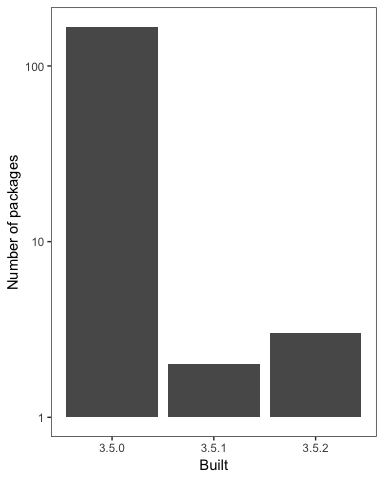

<!-- README.md is generated from README.Rmd. Please edit that file -->
packages-report
===============

Bonus activity prompt
---------------------

-   I presume you are hooked up to GitHub remote repo, covered in [Existing project, GitHub last](https://happygitwithr.com/existing-github-last.html). Summary:
-   Consider the convenience function `usethis::use_github()`. Or to do by hand:
-   Create a similarly-named repo on GitHub.
-   Add it to the local repo as the `origin` remote: `git remote add origin https://github.com/YOU/REPO.git`.
-   Push and cement the branch tracking relationship: `git push --set-upstream origin master`.
-   Push! Now your README is an excellent welcome mat and summary of your project.
-   On GitHub, in *Settings*, turn on GitHub Pages. Visit the given URL for an even more polished report of your project. It may take a few minutes to show up / update. Record that as the URL for your repo.

Overview
--------

The goal of packages-report is to think about how many packages I have and what version they were installed on. Very boring since I have a new computer.

I have 172 add-on packages installed.

Here's how they break down in terms of which version of R they were built under, which is related to how recently they were updated on CRAN.



### Flow of the analysis

*If you have time, document the analysis works, using internal links.*

*If you created some sort of controller script, describe that here.*

I wonder if I can use eucatastrophe in a sentence. Nope.

I super love git

<details>

<summary>Session info</summary>

``` r
devtools::session_info()
#> Session info -------------------------------------------------------------
#>  setting  value                       
#>  version  R version 3.5.2 (2018-12-20)
#>  system   x86_64, darwin15.6.0        
#>  ui       X11                         
#>  language (EN)                        
#>  collate  en_CA.UTF-8                 
#>  tz       America/Winnipeg            
#>  date     2019-01-16
#> Packages -----------------------------------------------------------------
#>  package    * version date       source         
#>  assertthat   0.2.0   2017-04-11 CRAN (R 3.5.0) 
#>  backports    1.1.2   2017-12-13 CRAN (R 3.5.0) 
#>  base       * 3.5.2   2018-12-22 local          
#>  bindr        0.1.1   2018-03-13 CRAN (R 3.5.0) 
#>  bindrcpp   * 0.2.2   2018-03-29 CRAN (R 3.5.0) 
#>  broom        0.5.0   2018-07-17 CRAN (R 3.5.0) 
#>  cellranger   1.1.0   2016-07-27 CRAN (R 3.5.0) 
#>  cli          1.0.0   2017-11-05 CRAN (R 3.5.0) 
#>  colorspace   1.3-2   2016-12-14 CRAN (R 3.5.0) 
#>  compiler     3.5.2   2018-12-22 local          
#>  crayon       1.3.4   2017-09-16 CRAN (R 3.5.0) 
#>  datasets   * 3.5.2   2018-12-22 local          
#>  devtools   * 1.13.6  2018-06-27 CRAN (R 3.5.0) 
#>  digest       0.6.16  2018-08-22 CRAN (R 3.5.0) 
#>  dplyr      * 0.7.8   2018-11-10 cran (@0.7.8)  
#>  evaluate     0.11    2018-07-17 CRAN (R 3.5.0) 
#>  forcats    * 0.3.0   2018-02-19 CRAN (R 3.5.0) 
#>  fs         * 1.2.6   2018-08-23 CRAN (R 3.5.0) 
#>  ggplot2    * 3.0.0   2018-07-03 CRAN (R 3.5.0) 
#>  glue         1.3.0   2018-07-17 CRAN (R 3.5.0) 
#>  graphics   * 3.5.2   2018-12-22 local          
#>  grDevices  * 3.5.2   2018-12-22 local          
#>  grid         3.5.2   2018-12-22 local          
#>  gtable       0.2.0   2016-02-26 CRAN (R 3.5.0) 
#>  haven        2.0.0   2018-11-22 CRAN (R 3.5.0) 
#>  here       * 0.1     2017-05-28 CRAN (R 3.5.0) 
#>  hms          0.4.2   2018-03-10 CRAN (R 3.5.0) 
#>  htmltools    0.3.6   2017-04-28 CRAN (R 3.5.0) 
#>  httr         1.3.1   2017-08-20 CRAN (R 3.5.0) 
#>  jsonlite     1.5     2017-06-01 CRAN (R 3.5.0) 
#>  knitr        1.20    2018-02-20 CRAN (R 3.5.0) 
#>  lattice      0.20-38 2018-11-04 CRAN (R 3.5.2) 
#>  lazyeval     0.2.1   2017-10-29 CRAN (R 3.5.0) 
#>  lubridate    1.7.4   2018-04-11 CRAN (R 3.5.0) 
#>  magrittr     1.5     2014-11-22 CRAN (R 3.5.0) 
#>  memoise      1.1.0   2017-04-21 CRAN (R 3.5.0) 
#>  methods    * 3.5.2   2018-12-22 local          
#>  modelr       0.1.2   2018-05-11 CRAN (R 3.5.0) 
#>  munsell      0.5.0   2018-06-12 CRAN (R 3.5.0) 
#>  nlme         3.1-137 2018-04-07 CRAN (R 3.5.2) 
#>  pillar       1.3.0   2018-07-14 CRAN (R 3.5.0) 
#>  pkgconfig    2.0.2   2018-08-16 CRAN (R 3.5.0) 
#>  plyr         1.8.4   2016-06-08 CRAN (R 3.5.0) 
#>  purrr      * 0.2.5   2018-05-29 CRAN (R 3.5.0) 
#>  R6           2.3.0   2018-10-04 cran (@2.3.0)  
#>  Rcpp         1.0.0   2018-11-07 cran (@1.0.0)  
#>  readr      * 1.3.1   2018-12-21 CRAN (R 3.5.0) 
#>  readxl       1.2.0   2018-12-19 CRAN (R 3.5.0) 
#>  rlang        0.3.0.1 2018-10-25 cran (@0.3.0.1)
#>  rmarkdown    1.10    2018-06-11 CRAN (R 3.5.0) 
#>  rprojroot    1.3-2   2018-01-03 CRAN (R 3.5.0) 
#>  rstudioapi   0.7     2017-09-07 CRAN (R 3.5.0) 
#>  rvest        0.3.2   2016-06-17 CRAN (R 3.5.0) 
#>  scales       1.0.0   2018-08-09 CRAN (R 3.5.0) 
#>  stats      * 3.5.2   2018-12-22 local          
#>  stringi      1.2.4   2018-07-20 CRAN (R 3.5.0) 
#>  stringr    * 1.3.1   2018-05-10 CRAN (R 3.5.0) 
#>  tibble     * 1.4.2   2018-01-22 CRAN (R 3.5.0) 
#>  tidyr      * 0.8.1   2018-05-18 CRAN (R 3.5.0) 
#>  tidyselect   0.2.5   2018-10-11 cran (@0.2.5)  
#>  tidyverse  * 1.2.1   2017-11-14 CRAN (R 3.5.0) 
#>  tools        3.5.2   2018-12-22 local          
#>  usethis    * 1.4.0   2018-08-14 CRAN (R 3.5.0) 
#>  utils      * 3.5.2   2018-12-22 local          
#>  withr        2.1.2   2018-03-15 CRAN (R 3.5.0) 
#>  xml2         1.2.0   2018-01-24 CRAN (R 3.5.0) 
#>  yaml         2.2.0   2018-07-25 CRAN (R 3.5.0)
```

</details>

*See <https://github.com/jennybc/wtf-packages-report-EXAMPLE> for a fully realized example.*
